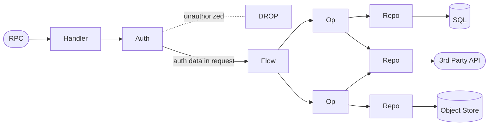
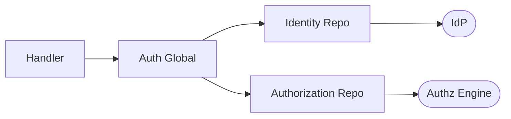
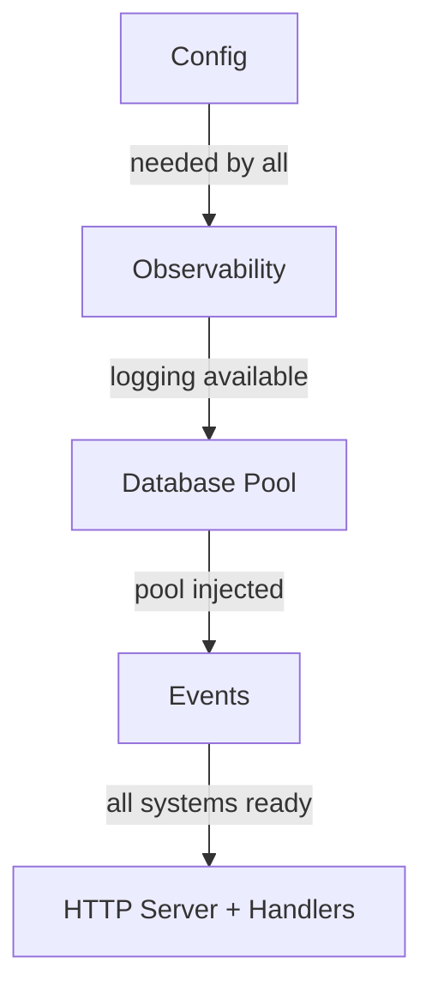

<p align="center">
  
</p>

# ROOTSTOCK by corewood.io

> Rootstock refers to the established root of a fruit plant that can be grafted with limbs from other trees. Because the established root proves hearty and reliable, the branches grow from its steady supply of nutrients and solid grounding.

ROOTSTOCK serves two purposes:
- A reference architecture for LLM-driven engineering which reliably scales, designed and used by [Corewood](https://corewood.io). Branch out without uprooting your project.
- A citizen scientific data collection platform — gamified campaigns connect researchers with citizen scientists who already own the sensors.

## System

Open-source, community-driven science data acquisition.

### Problem

Current methods of acquiring field data for scientific analysis are expensive, slow, and limited in geographic scope. Meanwhile, consumer IoT devices — weather stations, air quality monitors, water sensors, GPS-enabled devices — are already deployed at massive scale in people's homes and backyards. These are distributed mini-labs sitting idle. The **last-mile problem**: there is no standard, low-friction way to connect these consumer devices to active research needs.

### Solution

Researchers create **data campaigns** — structured requests specifying what data they need, where, when, and to what quality standard. Citizen scientists discover campaigns relevant to their location and equipment, connect their IoT devices, and contribute sensor readings. Engagement is incentivized through **gamification and sweepstakes** rather than per-unit compensation, so per-data-point cost approaches zero as the network grows.

| Actor | Role |
|-------|------|
| **Researchers** | Define campaigns, set quality thresholds, analyze collected data |
| **Citizen Scientists** | Discover campaigns, connect IoT devices, contribute readings |
| **IoT Devices** | Primary data source — untrusted input validated against campaign constraints |

The full requirements specification follows the [Volere template](./spec/).

## LLM assisted engineering

<p align="center">
  
</p>

Over the past ~11 months, Corewood has extensively leveraged LLM assisted engineering to great effect. Not only have we built [LandScope](https://landscope.earth) with the CEO [Mitch Rawlyk](https://mitch.earth), we have also built LLM inference engines, complex Postgres wire protocol interceptions, and even a bunch of websites.

We've spent a lot of time yelling at the LLM, and here we share some of our learning.

1. Manage context windows.
    Context windows present the biggest challenge. LLMs can effectively work on and solve codes at the smaller scale, but as the application grows the application buckles under its own weight. The LLMs get confused, find multiple patterns to follow, and ultimately fail to help your project grow.
1. Follow strict patterns.
    Do not give the LLM more choices than absolutely necessary. Every choice you give the LLM presents a risk to the stability of the project.

This repository demonstrates the effectiveness of ROOTSTOCK by showing a complete solution, starting with the architecture and requirements ([spec](./spec/)).

## Architecture

ROOTSTOCK uses [volatility-based decomposition](https://www.informit.com/articles/article.aspx?p=2995357&seqNum=2) to determine component boundaries — things that change independently are isolated behind separate boundaries so that a change in one area doesn't ripple across the system. [Clean Architecture](https://blog.cleancoder.com/uncle-bob/2012/08/13/the-clean-architecture.html) governs the dependency direction between those components: **source code dependencies always point inward**, from infrastructure toward domain logic.

### Request Pipeline

Every request flows through a four-layer pipeline. Each layer has a single responsibility and imports only from the layer below it.

| Layer | Responsibility |
|-------|---------------|
| **Handlers** | Protocol translation — accept a Connect RPC, run auth, drop unauthorized requests at edge, pass auth data explicitly into the flow request |
| **Flows** | Orchestration and sequencing of operations |
| **Ops** | Business logic — the actual rules and decisions |
| **Repo** | Data access and external service integration |

```
Handlers → Auth → Flow → Ops → Repo → SQL
```

Dependencies point inward along this pipeline. Nothing in an inner layer knows about anything in an outer layer.



**Handlers** sit at the edge. They resolve the protocol (Connect RPC) and run **auth** as a sub-flow. Unauthorized requests are dropped here — they never reach business logic. Auth-derived data (user ID, roles) is passed **explicitly into the flow request**, giving flows a clean contract with no hidden side-channel dependencies.

#### Auth Detail

Auth is a global concern that delegates to repos, following the same vendor-obfuscation pattern as observability. The handler calls the auth global, which calls identity and authorization repos. Vendors are implementation details hidden behind repo interfaces.



**Flows** orchestrate. A flow checks state and calls whichever ops it needs — any flow can call any op, there is no vertical grouping. Flows do not call repos directly.

**Ops** execute business logic. They are the only layer that calls repos, enforcing the Clean Architecture boundary between business rules and data access.

**Observability** is a global concern injected at construction time. It lives in `global/` and calls an **o11y repo** that wraps the specific implementation (currently OpenTelemetry) — the repo obfuscates vendor details so globals are never tied to a specific provider. O11y changes independently from business logic — a different axis of volatility.

### Initialization Order

The application starts up in strict sequential order — each layer depends on the one before it.



### Project Layout

```
rootstock/
├── spec/                          # Requirements (Volere template)
├── proto/rootstock/v1/            # Source .proto definitions
├── web-server/
│   ├── cmd/server/                # Entry point (main.go)
│   ├── config/                    # Hierarchical config loading
│   ├── global/
│   │   ├── observability/         # Singleton o11y accessor (delegates to repo)
│   │   └── events/                # Singleton events accessor (delegates to repo)
│   ├── handlers/connect/          # Protocol + auth resolution, calls flows
│   ├── flows/                     # Orchestration + sequencing
│   ├── ops/                       # Business logic
│   ├── repo/
│   │   ├── authorization/         # OPA policy evaluation
│   │   ├── observability/         # OpenTelemetry implementation
│   │   ├── events/                # DBOS workflow implementation
│   │   └── sql/connect/           # PostgreSQL connection (pgx)
│   ├── server/                    # Server wiring and middleware
│   └── proto/rootstock/v1/        # Generated protobuf + Connect code
├── compose/                       # Podman/Docker Compose orchestration
├── build/                         # Container images (dev & prod)
└── configs/                       # Service configs (Caddyfile)
```

Each directory maps to a single boundary drawn by volatility. Imports along the pipeline point inward: `handlers/` → `flows/` → `ops/` → `repo/`, never the reverse. Auth is resolved at the handler (edge), not as a separate cross-cutting layer. Observability (`global/`) is injected at construction time and changes independently from business logic.

## Tech Stack

| Concern | Technology |
|---------|------------|
| Language | Go |
| RPC | [Connect RPC](https://connectrpc.com/) (protobuf) |
| Database | PostgreSQL ([pgx](https://github.com/jackc/pgx)) |
| Identity | [Zitadel](https://zitadel.com/) |
| Authorization | [Open Policy Agent](https://www.openpolicyagent.org/) |
| Workflow Engine | [DBOS](https://dbos.dev/) |
| Observability | [OpenTelemetry](https://opentelemetry.io/) → Prometheus, Tempo, Loki, Grafana |
| Config | [koanf](https://github.com/knadh/koanf) (YAML → env → flags) |
| Reverse Proxy | [Caddy](https://caddyserver.com/) |
| Containers | Podman Compose |

## Prerequisites

- [Podman](https://podman.io/) with `podman compose` (or Docker with `docker compose`)
- That's it — Go, buf, air, and all other tooling run inside containers.

## Getting Started

```bash
git clone https://github.com/corewood-io/rootstock.git
cd rootstock
make up
```

This starts the full stack: web server, databases, identity provider, observability, and reverse proxy.

The web server hot reloads on file changes — edit Go code and it rebuilds automatically.

### Verify

Health check (binary protobuf — JSON is rejected by the server):

```bash
curl -s -X POST http://localhost:8080/rootstock.v1.HealthService/Check \
  -H "Content-Type: application/proto" --data-binary ''
```

### Observe

| Service | URL |
|---------|-----|
| Grafana | http://localhost:9999/grafana/ |
| Prometheus | http://localhost:9999/prometheus/ |

### Generate Protobuf

```bash
make proto
```

### Stop

```bash
make down
```

## Contributing

See [CONTRIBUTING.md](CONTRIBUTING.md). Open an issue before writing code. Keep changes focused and match existing patterns.

## License

[BSD 3-Clause](LICENSE) — Copyright 2026, Corewood.

