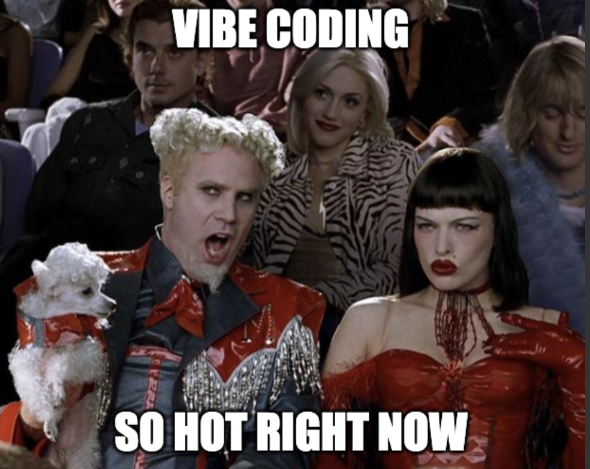
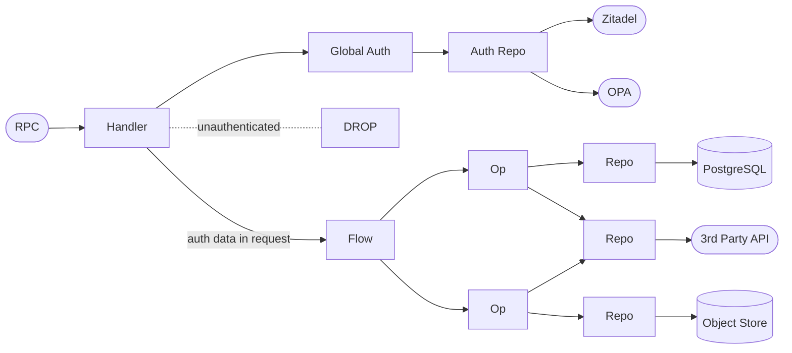
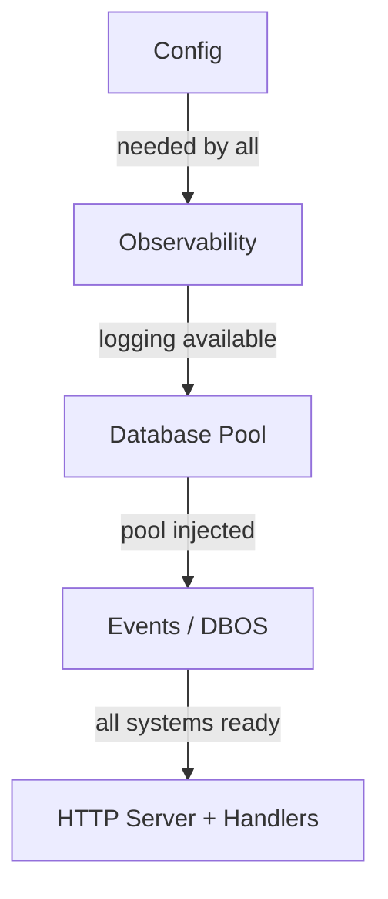

<p align="center">
  
</p>

# ROOTSTOCK by corewood.io

> Rootstock refers to the established root of a fruit plant that can be grafted with limbs from other trees. Because the established root proves hearty and reliable, the branches grow from its steady supply of nutrients and solid grounding.

A reference architecture for LLM-driven engineering which reliably scales.
Branch out without uprooting your project.

## LLM assisted engineering

<p align="center">
  
</p>

Over the past ~11 months, Corewood has extensively leveraged LLM assisted engineering to great effect. Not only have we built [LandScope](https://landscope.earth) with the CEO [Mitch Rawlyk](https://mitch.earth), we have also built LLM inference engines, complex Postgres wire protocol interceptions, and even a bunch of websites.

We've spent a lot of time yelling at the LLM, and here we share some of our learning.

1. Manage context windows.
    Context windows present the biggest challenge. LLMs can effectively work on and solve codes at the smaller scale, but as the application grows the application buckles under its own weight. The LLMs get confused, find multiple patterns to follow, and ultimately fail to help your project grow.
1. Follow strict patterns.
    Do not give the LLM more choices than absolutely necessary. Every choice you give the LLM presents a risk to the stability of the project.

This repository demonstrates the effectiveness of ROOTSTOCK by showing a complete solution, starting with the architecture and requirements ([spec](./spec/)).

## Architecture

ROOTSTOCK uses [volatility-based decomposition](https://www.informit.com/articles/article.aspx?p=2995357&seqNum=2) to determine component boundaries — things that change independently are isolated behind separate boundaries so that a change in one area doesn't ripple across the system. [Clean Architecture](https://blog.cleancoder.com/uncle-bob/2012/08/13/the-clean-architecture.html) governs the dependency direction between those components: **source code dependencies always point inward**, from infrastructure toward domain logic.

### Request Pipeline

Every request flows through a four-layer pipeline. Each layer has a single responsibility and imports only from the layer below it.

| Layer | Responsibility |
|-------|---------------|
| **Handlers** | Protocol translation and auth — accept a Connect RPC, resolve identity (Zitadel) and authorization (OPA), drop unauthenticated requests at edge, pass auth data explicitly into the flow request |
| **Flows** | Orchestration and sequencing of operations |
| **Ops** | Business logic — the actual rules and decisions |
| **Repo** | Data access and external service integration |

```
Handlers → Flows → Ops → Repo → PostgreSQL
```

Dependencies point inward along this pipeline. Nothing in an inner layer knows about anything in an outer layer.



**Handlers** sit at the edge. They resolve the protocol (Connect RPC) and authenticate/authorize via a **global** — the only handler → global → repo path in the system. The auth global calls the auth repo (Zitadel for identity, OPA for authorization). Unauthenticated or unauthorized requests are dropped here — they never reach business logic. Auth-derived data (user ID, roles) is passed **explicitly into the flow request**, giving flows a clean contract with no hidden side-channel dependencies.

**Flows** orchestrate. A flow checks state and calls whichever ops it needs — any flow can call any op, there is no vertical grouping. Flows do not call repos directly.

**Ops** execute business logic. They are the only layer that calls repos, enforcing the Clean Architecture boundary between business rules and data access.

**Observability** is a global concern injected at construction time. It lives in `global/` and calls an **o11y repo** that wraps the specific implementation (currently OpenTelemetry) — the repo obfuscates vendor details so globals are never tied to a specific provider. O11y changes independently from business logic — a different axis of volatility.

### Initialization Order

The application starts up in strict sequential order — each layer depends on the one before it.



### Project Layout

```
rootstock/
├── spec/                          # Requirements (Volere template)
├── proto/rootstock/v1/            # Source .proto definitions
├── web-server/
│   ├── cmd/server/                # Entry point (main.go)
│   ├── config/                    # Hierarchical config loading
│   ├── global/
│   │   ├── observability/         # OpenTelemetry traces, metrics, logs
│   │   └── events/                # DBOS workflow engine
│   ├── handlers/connect/          # Protocol + auth resolution, calls flows
│   ├── flows/                     # Orchestration + sequencing
│   ├── ops/                       # Business logic
│   ├── repo/sql/connect/          # Data access (pgx)
│   ├── server/                    # Server wiring and middleware
│   └── proto/rootstock/v1/        # Generated protobuf + Connect code
├── compose/                       # Podman/Docker Compose orchestration
├── build/                         # Container images (dev & prod)
└── configs/                       # Service configs (Caddyfile)
```

Each directory maps to a single boundary drawn by volatility. Imports along the pipeline point inward: `handlers/` → `flows/` → `ops/` → `repo/`, never the reverse. Auth is resolved at the handler (edge), not as a separate cross-cutting layer. Observability (`global/`) is injected at construction time and changes independently from business logic.

