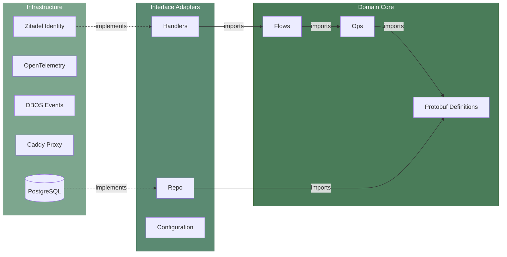
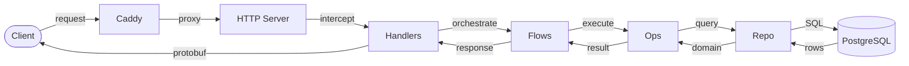
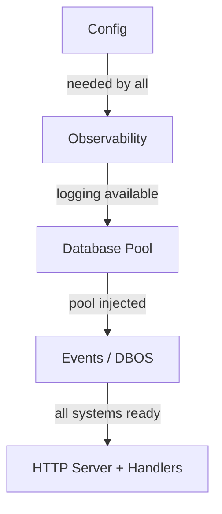

<p align="center">
  
</p>

# ROOTSTOCK by corewood.io

> Rootstock refers to the established root of a fruit plant that can be grafted with limbs from other trees. Because the established root proves hearty and reliable, the branches grow from its steady supply of nutrients and solid grounding.

A reference architecture for LLM-driven engineering which reliably scales.
Branch out without uprooting your project.

## LLM assisted engineering

<p align="center">
  
</p>

Over the past ~11 months, Corewood has extensively leveraged LLM assisted engineering to great effect. Not only have we built [LandScope](https://landscope.earth) with the CEO [Mitch Rawlyk](https://mitch.earth), we have also built LLM inference engines, complex Postgres wire protocol interceptions, and even a bunch of websites.

We've spent a lot of time yelling at the LLM, and here we share some of our learning.

1. Manage context windows.
    Context windows present the biggest challenge. LLMs can effectively work on and solve codes at the smaller scale, but as the application grows the application buckles under its own weight. The LLMs get confused, find multiple patterns to follow, and ultimately fail to help your project grow.
1. Follow strict patterns.
    Do not give the LLM more choices than absolutely necessary. Every choice you give the LLM presents a risk to the stability of the project.

This repository demonstrates the effectiveness of ROOTSTOCK by showing a complete solution, starting with the architecture and requirements ([spec](./spec/)).

## Architecture

ROOTSTOCK follows [Clean Architecture](https://blog.cleancoder.com/uncle-bob/2012/08/13/the-clean-architecture.html) principles. The core idea: **source code dependencies point inward, while data flows outward**. Inner layers define interfaces; outer layers implement them. This keeps business logic independent of frameworks, databases, and transport — making the system testable, swappable, and resilient to change ([summary by Martin](https://blog.cleancoder.com/uncle-bob/2011/11/22/Clean-Architecture.html)).

### Application Layers

The request pipeline has four distinct layers, each with a single responsibility:

| Layer | Responsibility |
|-------|---------------|
| **Handlers** | Protocol translation, identity resolution, auth enforcement |
| **Flows** | Orchestration and sequencing of operations |
| **Ops** | Business logic — the actual rules and decisions |
| **Repo** | Data access and external service integration |

### Dependency Rule

Imports always point inward — from infrastructure toward the domain. Nothing in an inner layer knows about anything in an outer layer.



### Data Flow

Data enters from the outside world and moves inward through the layers. Responses travel back out the same path. The arrows here represent **data movement** — the opposite direction of the dependency arrows above.



### Initialization Order

The application starts up in strict sequential order — each layer depends on the one before it.



### Project Layout

```
rootstock/
├── spec/                          # Requirements (Volere template)
├── proto/rootstock/v1/            # Source .proto definitions
├── web-server/
│   ├── cmd/server/                # Entry point (main.go)
│   ├── config/                    # Hierarchical config loading
│   ├── global/
│   │   ├── observability/         # OpenTelemetry traces, metrics, logs
│   │   └── events/                # DBOS workflow engine
│   ├── handlers/connect/          # Protocol + auth resolution
│   ├── flows/                     # Orchestration + sequencing
│   ├── ops/                       # Business logic
│   ├── repo/sql/connect/          # Data access (pgx)
│   ├── server/                    # HTTP interceptors & middleware
│   └── proto/rootstock/v1/        # Generated protobuf + Connect code
├── compose/                       # Podman/Docker Compose orchestration
├── build/                         # Container images (dev & prod)
└── configs/                       # Service configs (Caddyfile)
```

Each directory maps to a single architectural layer. Imports only reach inward: `handlers/` → `flows/` → `ops/` → `repo/`, never the reverse.

